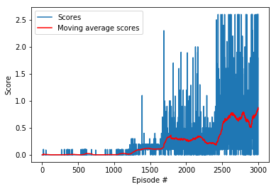
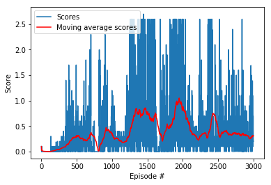
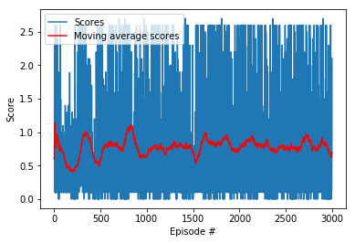
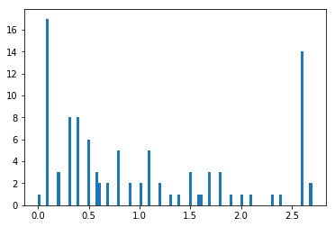
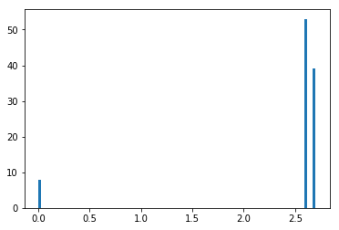

# Collaboration and Competition
## Train an Agent to Play Tennis by Krasin Georgiev

This report describes an implementation of the **Collaboration and Competition** project from the Udacity's [Deep Reinforcement Learning Nanodegree](https://www.udacity.com/course/deep-reinforcement-learning-nanodegree--nd893) program. The same approach as the one in [Project 2](https://github.com/krasing/DRLearningContinuousControl) is used with special emphasize on hyperparameters tuning. 

## Learning Algorithm

The task was solved using the Actor-Critic method Deep Deterministic Policy Gradients (DDPG, [1]). The agent is composed of an Actor and a Critic networks. The Actor network is used to calculate the action based on the current state. The Critic network is used to predict the Q-value, i.e. the value of the current (state, action). The negative of the Q-value is used as a loss measure for training the Actor network. To measure the loss of the Critic network, a "true" or target Q-value is calculated using the Bellman equation, which in pseudocode looks like `Q_targets = rewards + gamma * critic_target(next_states, actions_next)`

An attempt was made to implement Multi-Agent Actor-Critic model following [2] but the problem was not well fit for this approach. This preliminary work is saved in the [failed_collaborative](./failed_collaborative) folder. The main difference is that the observations and the actions of both agents are used as input for the critic network.

### The Actor network

The Actor network used three fully connected layers. The first and the second hidden layers had 400 and 300 activations respectively. The non-linearity in all layers but the last was ReLU. For the last layer it was **tanh** to provide an output between -1 and 1. Batched normalization was performed on the input to each layer. 

The input to the Actor network is the state defined by 24 continuous values corresponding to observations. The output is the action defined by 2 continuous values corresponding to horizontal and vertical movement of the Agent.

### The Critic network

The Critic network used three fully connected layers. The output of the last layer was single number - the Q-value. 

The input to the first layer was the state (24 units) and the output had 400 activations. The input to the second layer was the output of the first layer concatenated with the action input (2 units). The output of the second layer had 300 units.

### Training

The training algorithm is implemented in the function `ddpg()`. The interaction with the envoronment is similar to the one from [Project 1](https://github.com/krasing/DRLearningNavigation/blob/master/Report.ipynb). The differences are in the agent as defined in `class Agents()` based on the algorithm in [2]:
 - at each step the experience from all agents is collected into the buffer memory. Then a sample from the memory is taken and the learning method `self.learn(experiences, GAMMA)` is called
 - the action function `act()` infolves calculation of the action for all agents. The local Actor network `actor_local(state)` is called for the whole batch. Additional noise of class `OUNoise()` is added to explore the action space.

The model with highest scores was saved for further training and fine tuning. The following parts of the model and the optimizer were saved:

    state = {
        'episode': i_episode,
        'score_avg': avg_score,
        'score': current_score,
        'actor_local': agent.actor_local.state_dict(),
        'actor_target': agent.actor_target.state_dict(),
        'critic_local': agent.critic_local.state_dict(),
        'critic_target': agent.critic_target.state_dict(),
        'agent_optimizer' : agent.actor_optimizer.state_dict(),
        'critic_optimizer' : agent.critic_optimizer.state_dict(),
        'batch_size': agent.memory.batch_size,
    }
    
The functions `save_checkpoint(state, filename='checkpoint.pth.tar')` and `load_checkpoint(agent, filename='checkpoint.pth.tar')` were introduced to handle saving and loading of trained model parameters

### Learning

Learning is performed by the `learn()` method of the `Agent()` class.
The loss function and the gradient propagations worth further description. Explore how the implementation in code corresponds to *Algorithm 1* in [1]. (More explanations to be added here!)

### Performance evaluation

Performance evaluation was done using `test_ddpg(n_episodes=100)`. Unlike the training `ddpg()`, the random variation of the action was supressed `actions = agent.act(states, add_noise=False)` and the the learning part `agent.step(state, action, rewards, next_state, dones)` was removed from the code.

### Hyperparameters and fine tuning

The training started with the default training hyperparameters:

    BUFFER_SIZE = int(1e5)  # replay buffer size
    BATCH_SIZE = 128        # minibatch size
    GAMMA = 0.99            # discount factor
    TAU = 1e-3              # for soft update of target parameters
    LR_ACTOR = 1e-4         # learning rate of the actor 
    LR_CRITIC = 1e-3        # learning rate of the critic
    WEIGHT_DECAY = 0        # L2 weight decay

An example plot of the scores is shown below:

It worth noting that this picture can vary and the reward is not necessarily increasing:

The target 0.5 score is achieved at episode 2500 for the first case and at episode 1200 for the second case. The best average score was **0.873** at Episode 2999. The performanee is somehow connected with the ability of the computer to generate random numbers - it degrades if there is no interaction with the computer, e.g. the computer is left overnight just to train the network.

The model with best parameters was loaded and the learning rates were reduced by a factor of four:

    agent.actor_optimizer.param_groups[0]['lr']=agent.actor_optimizer.param_groups[0]['lr']/4
    agent.critic_optimizer.param_groups[0]['lr']=agent.critic_optimizer.param_groups[0]['lr']/4
    
The result is stable performance without further improvement:

The best model selected was from episode 834 (3000 + 834) with score 2.200 and avg **1.097**.

The model performance was evaluated again using `test_ddpg(n_episodes=100)`. The mean score over 100 episodes was 1.043. More interesting was the distribution of the scores:

There is a peak of scores close to zero. This means that the initial part of the game is critical. We need more training that target only the first steps of the game. 

We reduce the number of steps from 1000 to 100:

    max_t=100

    scores = ddpg(1000, max_t=max_t)

To reduce the chance to mess up with the already quite good model we:

- reduce the noise that is added to the action and 

    agent.noise.sigma = agent.noise.sigma/4
    
- increase the batch size `BATCH_SIZE`

    agent.memory.batch_size = agent.memory.batch_size * 4
    
The model performance was evaluated again using `test_ddpg(n_episodes=100)` and the improvement is more than good. The number of short games is close to zero.

RESULT: Mean score over 100 episodes: **2.431**

## Ideas for Future Work

The agent is close to perfect. Performance could be further improved by using standard techniques for better neural network training:
 - more training for short games
 - continue the training with reduced learning rates `LR_ACTOR` and `LR_CRITIC`
 - increase the `BATCH_SIZE` 
 
Implement and train a more complex model like Multi-Agent collaboration [2] using:
 - add dropout layers or other forms of regularization in the model;
 - try a Competition instead of Collaboration to train for harder cases.

## References

1. Lillicrap T.P., Hunt J.J., Pritzel A., et.al., Continuous control with deep reinforcement learning, arXiv:1509.02971v5, https://arxiv.org/abs/1509.02971

2. Lowe R., Yi Wu, Tamar A., Harb J., Abbeel P., Mordatch I., Multi-Agent Actor-Critic for Mixed Cooperative-Competitive Environments, 2017, https://arxiv.org/abs/1706.02275

3. Implementations of the **Deep Deterministic Policy Gradients**: https://github.com/udacity/deep-reinforcement-learning/tree/master/ddpg-pendulum): Use OpenAI Gym's Pendulum environment.
